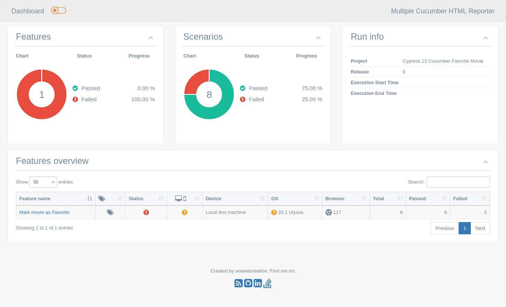

# Automation Testing Fitur 'Favorite Movie' dengan Cypress dan Cucumber (BDD)

Hi....
Ini adalah project automation test fitur 'Favorite Movie' pada situs TMDB

- untuk test scenario & how we verify ada [Disini](TestScenario.md)


### System Requirement
Untuk dapat menjalankan automation test ini, 

- Noje.js (Tested on v18.20.4, sebelumnya juga jalan pakai v16) 
- Browser (Chrome, Firefox atau pakai bawaan cypress ini (Electron))


### How To Play?
Setelah kedua requirement diatas terpenuhi, project ini sudah dapat dijalankan dengan cara  mengclone this repo atau download secara manual kemudian extract, lalu buka terminal/cmd, masuk ke direktori dimana project ini diextract

- jalankan 'npm install'
- tunggu hingga prosesnya selesai
- setelah itu silahkan buat akun pada themoviedb.org, karna test ini membutuhkan akun untuk dapat dijalankan. lalu
- buka file 'cypress.config.js', ganti value dari property berikut dengan akun kamu

```
env: {
    username: 'YOUR-USERNAME',
    password: 'YOUR-PASSWORD',
  }
```

- kembali ke terminal/cmd lalu ketik 'npx cypress open'
- tunggu hingga cypress terbuka, lalu pilih 'E2E Testing'
- pilih browser lalu klik 'Start E2E Testing in ...'


### Generating HTML test result
- masih diterminal, jalankan 'node cucumber-report.js'
- Masuk ke folder 'reports' lalu buka 'index.html' dengan browser
- klik pada test feature file untuk melihat detail


### Test Result

Test_Favorite_Movie.feature


Detail Per Scenario


Vide Record
[Result.mkv](test-result.mkv)


Enjoy.....


Tested ON:
- Linux Mint 
- Chrome Version : v117
- Electron Version : v114


SALAM... 

