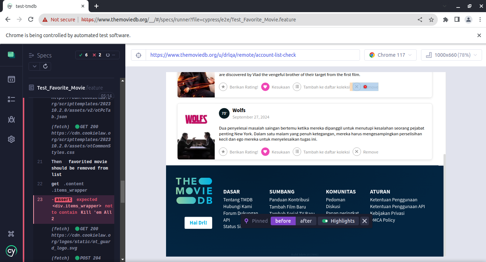
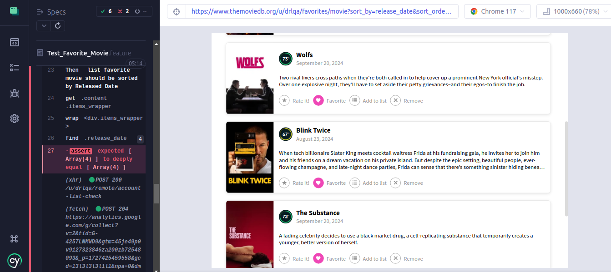
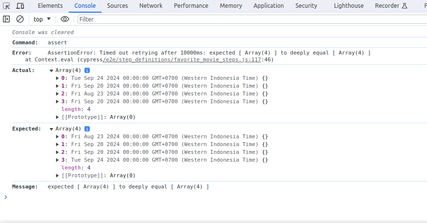

# Test Scenario dan Penjelasan How We Verify Each Case with This Tools

## Full Scenario in Gherkin

```
@SL
Feature: Switch language
   	 
    Scenario: Change language to Indonesia
      Given user opening switch language pop up
      When user choose 'Indonesia' language with prefix 'Ind'
      And reload the page
      Then the language should changed to 'Indonesia'

    Scenario: Fallback back to English
      Given user opening switch language pop up
      When user choose 'English' language with prefix 'Eng'
      And reload the page
      Then the language should changed to 'English'
```

```
@MAF
Feature: Mark movie as Favorite
    
    User dapat menyimpan Movie kedalam daftar favorit mereka
    movies favorit akan tampil pada halaman favorite dari masing-masing user

    @must-logged-in
    Scenario: Clear favorite movie list
      Given user clear favorite movie list

    @close-cookie-box @lang-id
    Scenario: Users can only “mark as favorite” when they are logged in
        Given user at home page
        When user choose movie at number 1
        Then user should see detail movie page
        And user click Mark as Favorite button
        Then Mark as Favorite icon color is 'Not Pink'
        And Mark as Favorite button should show tooltip 'Masuk untuk menambahkan film ke daftar sukaan anda'
    
    @must-logged-in @lang-id
    Scenario: User can mark movie as favorite
      Given user at home page
      When user choose movie at number 2
      Then user should see detail movie page
      And user click Mark as Favorite button
      Then Mark as Favorite icon color is 'Pink'
      Given user at favorite movie page
      Then user should see the favorited movie

    @must-logged-in @lang-id
    Scenario: User can mark movie as favorite more than once
      Given user at home page
      When user choose movie at number 4
      Then user should see detail movie page
      And user click Mark as Favorite button
      Then Mark as Favorite icon color is 'Pink'
      Given user at favorite movie page
      Then user should see the favorited movie
      And verify count of favorited movie more than one

    @must-logged-in @lang-id
    Scenario: User can remove movie from their favorite list
      Given user at favorite movie page
      And user remove favorited movie from their favorite list
      Then favorited movie should be removed from list

    @must-logged-in @lang-id
    Scenario Outline: We Need minimum 3 item to test sorting test, so add again
      Given user at home page
      When user choose movie at number <number>
      Then user should see detail movie page
      And user click Mark as Favorite button
      Then Mark as Favorite icon color is 'Pink'

      Examples:
        | number|
        |    6  |
        |    8  |

    @must-logged-in @lang-en
    Scenario: User can sorting their favorited movie by released date
      Given user at favorite movie page
      When user sort by Released Date
      Then list favorite movie should be sorted by Released Date
```


Scenario Fail

- Fail karna tombol remove movie from favorit tidak bekerja




- Fail karna setelah di urutkan berdasarkan 'Released Date' (default asc), belum terurut dengan benar

Hasil

Comparison



## HO DO WE VERIFY THIS ?

Fitur @MAF

#### Scenario: Users can only “mark as favorite” when they are logged in
- Memastikan icon favorit tidak berubah saat klik favorit tanpa login
- Meastikan muncul popup 'Masuk untuk menambahkan film ke daftar sukaan anda'
 dalam bahasa indonesia

#### Scenario: User can mark movie as favorite
- Memastikan icon favorit berubah ke warna Pink
- Menyimpan movie title sebagai cypress alias untuk kemudian
- Melakukan pengecekan di halaman favorit bahwa movie dengan title tersebut muncul di daftar favorit

#### Scenario: User can mark movie as favorite more than once
- Memastikan icon favorit berubah ke warna Pink
- Menyimpan movie title sebagai cypress alias untuk kemudian
- Melakukan pengecekan di halaman favorit bahwa movie dengan title tersebut muncul di daftar favorit
- Melakukan verifikasi jumlah movie pada title count lebih dari satu
- Melakukan verifikasi jumlah movie yg tampil lebih dari satu


#### Scenario: User can remove movie from their favorite list
- Menyimpan movie title sebagai cypress alias untuk kemudian
- Setelah klik remove, melakukan verifikasi title tersebut sudah tidak ada didaftar favorit

#### Scenario: User can sorting their favorited movie by released date
THE HARDEST PART
ada 3 sorting yang harus ditest yaitu 'Date Added', 'Popularity' dan 'Released Date'
ketiganya mempunyai sub fitur order asc/desc
tak ada banyak informasi untuk dijadikan acuan pengetesan seperti,
kita tidak tau tingkat popularitas movie diambil dari attribute apa,
hanya ada 1 field yg tertera yaitu released date, maka kita menggunakan value tersebut
yg kita jadikan array kemudian kita sorting dengan lodash.

- mengambil semua date released, menjadikannya array
- menggunakan lodash sortBy untuk mengurutkan
- membandingkan apakah hasil urutan dari lodash sesuai dengan urutan movie yg tampil

untuk kedua lainnya waktunya ng nututin :)

Fitur @SL

#### Scenario: Change language to Indonesia
- Memastikan title, heading, menu, desciprtion dan yg lainnya sesuai dengan bahasa terpilih


### The Problem
Problem to automated date switching using cypress
analisa sementara dikarnakan plugin language menggunakan kendo-ui
bugnya adalah close immediately ketika di ifram, dan cypress adalah iframe
tetapi fitur ini bisa dijalankan via Selenium dan Playwright

sehingga saya set language ke Indonesia dengan setting cookie


SEKIAN....
saran? ada beberapa tp ng nutut hehe